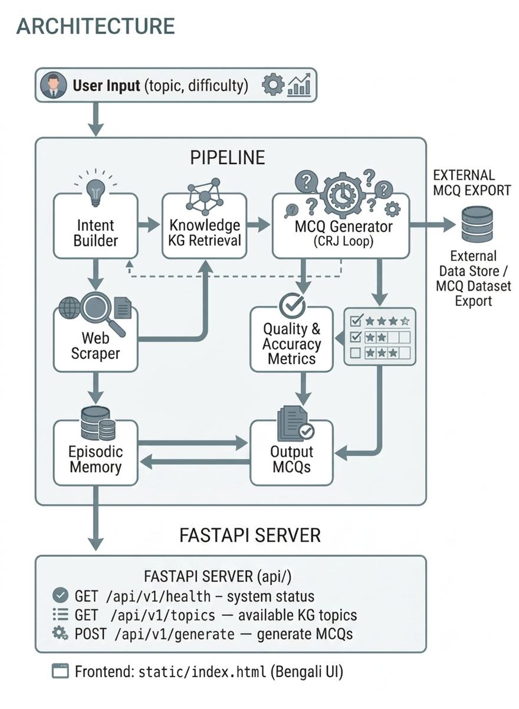

# BCS Batighor — Automatic MCQ Generation for BCS Exams

Generate high-quality Bengali MCQs for Bangladesh Civil Service (BCS) exams using an LLM-powered agent pipeline with a knowledge graph.

## Architecture


## Project Structure

```
bcs-batighor/
├── src/bcs/                  # Main Python package
│   ├── pipeline/             # Core pipeline agents
│   │   ├── main_pipeline.py  # Orchestrator — wires all agents
│   │   ├── intent_builder.py # Topic → blueprint extraction
│   │   ├── input_normalizer.py# Bangla text normalization
│   │   ├── kg_builder.py     # Knowledge graph (NetworkX)
│   │   ├── episodic_store.py # SQLite episodic memory
│   │   ├── fact_quality.py   # Fact quality scoring
│   │   └── web_scraper.py    # Web search + sentence extraction
│   ├── generators/
│   │   └── mcq_generator.py  # CRJ loop: Challenger→Reasoner→Judge
│   ├── quality/
│   │   ├── mcq_quality.py    # 4-dimension MCQ quality judge
│   │   └── bcs_metrics.py    # TAS, QSS, DDMS, Grounding metrics
│   ├── api/                  # FastAPI server
│   │   ├── main.py           # App creation
│   │   ├── routes.py         # API endpoints
│   │   └── schemas.py        # Pydantic models
│   ├── config.py             # Centralized path configuration
│   ├── rate_limiter.py       # Shared Groq API rate limiter
│   └── logging_config.py     # UTF-8 logging setup
├── data/                     # BCS fact datasets (JSON)
├── static/                   # HTML frontend
├── docs/                     # Documentation
│   ├── Workflow.md           # Full project roadmap
│   └── FIX_REPORT.md         # Audit of all fixes applied
├── tests/                    # Unit tests (placeholder)
├── notebooks/                # Research experiments
├── config/                   # Configuration templates
├── runtime/                  # Runtime artifacts (gitignored)
├── Dockerfile
├── docker-compose.yml
├── setup.py                  # pip install -e .
└── requirements.txt
```

## Quick Start

```bash
# 1. Clone + install
git clone <repo-url>
cd bcs-batighor
pip install -e .

# 2. Set up Groq API key
cp .env.example .env
# Edit .env with your key from https://console.groq.com

# 3. Run CLI
python run_pipeline.py --topic "History" --difficulty easy --count 1

# 4. Run API server
uvicorn bcs.api.main:app --host 0.0.0.0 --port 8000
# Open http://localhost:8000
```

## Key Concepts

| Term | Meaning |
|---|---|
| **KG** | Knowledge Graph — NetworkX graph of facts from BCS datasets |
| **CRJ Loop** | Challenger→Reasoner→Judge: generate, verify, score MCQs |
| **Episodic Memory** | SQLite DB storing past episodes for reuse |
| **TAS** | Topic Alignment Score — how well MCQs match BCS topics |
| **QSS** | Question Similarity Score — similarity to real BCS questions |
| **DDMS** | Difficulty Distribution Matching Score |

## Status

Pre-deployment. Core pipeline works. See `docs/Workflow.md` for the full roadmap and `docs/FIX_REPORT.md` for known issues.
